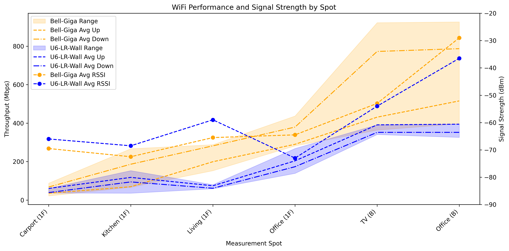

# WiFi Performance Analysis and Testing

This was a quick project to gather and measure WiFi performance in the house, in order to understand the characteristics of my WiFi deployment. Specifically as I was planning to revamp my networking setup, which included a new UniFi U6-LR AP.

So I wanted a baseline characterization of my provider's router (Bell Giga router) and potentially to find an optimal placement for my new UniFi AP.

## Overview

The project facilitates WiFi throughput measurement and provides visualization  for performance analysis, comparing router performance across different Access Point locations using mobile devices as clients.

The conclusion was that the Bell Giga router was superior in all respects, but we will still migrate the the new UniFi setup, for other reasons (configurability, security, independence from the provider).

Published at: <https://wifidan.netlify.app/>

## TODO

- Take a look at <https://github.com/hnykda/wifi-heatmapper?tab=readme-ov-file>

## Project Structure

- [miperf3/](miperf3/README.md) - iperf3 installer script for my mobile devices
- [python-viz/](python-viz/README.md) - Python visualization script
- [web-viz/](web-viz/README.md) - Web visualization script
- [data/](data/) - Measurement data and png of python viz

## Manual Data Collection

WiFi performance measurements were collected across multiple locations (Spots) comparing two router configurations, from two different devices (Clients):

Test Setup:

- Routers: Bell Giga, UniFi U6-LR Wall
- Clients: iPad Air 4, Pixel 6
- Spots: Carport (1F), Kitchen (1F), Living (1F), Office (1F), TV (B), Office (B)
- Metrics: Signal strength (dBm), Download speed (Mbps), Upload speed (Mbps)

Data File:

- The data was captured in Numbers/iPad - UniFi-WiFi-Placement.numbers (iCould).
- `data/UniFi-WiFi-Placement-2025-06-24.csv` - Normalized measurement data in CSV
- `data/UniFi-WiFi-Placement-2025-06-24.png` - High-resolution plot export - created by `plot.py`

## Data Format

The CSV data follows this structure:

| Column     | Description                            | Example        |
|------------|----------------------------------------|----------------|
| Spot       | Measurement location                   | "Kitchen (1F)" |
| Router     | Router model being tested              | "Bell Giga"    |
| Client     | Device used for testing                | "iPad Air 4"   |
| Signal dBm | WiFi signal strength (negative values) | -45            |
| Down Mbps  | Download speed in megabits per second  | 623            |
| Up Mbps    | Upload speed in megabits per second    | 498            |

## Dependencies

Python Analysis:

- pandas - Data manipulation and analysis
- matplotlib - Static plotting and visualization
- numpy - Numerical operations

Mobile Testing:

- iperf3 - Network performance measurement tool
- Terminal emulator (iSH on iOS, Termux on Android)

Web Visualization:

- Plotly.js v3.0.1 - Interactive web-based plotting
- Modern web browser with JavaScript support
