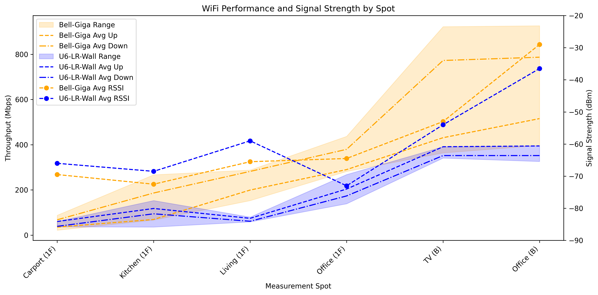

# WiFi Performance Analysis and Testing

This was a quick project to gather and measure WiFi performance in the house, in order to understand the characteristics of my WiFi deployment. Specifically as I was planning to revamp my networking setup, which included a new UniFi U6-LR AP.

So I wanted a baseline characterization of my provider's router (Bell Giga router) and potentially to find an optimal placement for my new UniFi AP.

## Overview

The project facilitates WiFi throughput measurement and provides visualization  for performance analysis, comparing router performance across different Access Point locations using mobile devices as clients.

The conclusion was that the Bell Giga router was superior in all respects, but we will still migrate the the new UniFi setup, for other reasons (configurability, security, independence from the provider).

Published at: <https://wifidan.netlify.app/>



## Project Structure

### 1. Measurement Tools (miperf3)

Becaus I fould the available tools to be seriously lacking or ridiculously expensive, I simply creates a simple way to run iperf, on both my mobile devices.

Using [Ish](https://ish.app/) and [Termux](https://wiki.termux.com/wiki/Main_Page), I was able to install a script to run iperf3 in both of these environments with a simple, one-liner.

The script is embedded in an installer script, which is published to a shorted url.

- Bitly short URL: <https://bit.ly/miperf3-inst>
- Points to Gist permanent URL: <https://gist.githubusercontent.com/daneroo/f172382fe6027a20c4d910541f1ff708/raw/iperf3-mobile-install.sh>
- `iperf3-mobile-install.sh` - Cross-platform installer script
- `miperf3.sh` - The file that the installer creates on the client device

Usage (on the client device):

```bash
# Install the tool
curl -sL bit.ly/miperf3-inst | sh

# Run speed test
./miperf3.sh
```

Publish a new version by:

```bash
# Update the gist with latest version
gh gist edit f172382fe6027a20c4d910541f1ff708 --add ./iperf3-mobile-install.sh

# Original gist creation (for reference)
gh gist create ./iperf3-mobile-install.sh --public --desc "iperf3 mobile testing script installer"
```

### 2. Data Collection

WiFi performance measurements were collected across multiple locations (Spots) comparing two router configurations, from two different devices (Clients):

**Test Setup:**

- **Routers:** Bell Giga, UniFi U6-LR Wall
- **Clients:** iPad Air 4, Pixel 6
- **Spots:** Carport (1F), Kitchen (1F), Living (1F), Office (1F), TV (B), Office (B)
- **Metrics:** Signal strength (dBm), Download speed (Mbps), Upload speed (Mbps)

**Data File:**

- The data was captured in Numbers/iPad - `UniFi-WiFi-Placement.numbers (iCould)`.
- `UniFi-WiFi-Placement-2025-06-24.csv` - Normalized measurement data in CSV

### 3. Python Visualization

Interactive matplotlib-based analysis with comprehensive data validation and statistical visualization.

**Features:**

- Throughput range visualization (min/max across all measurements)
- Average download/upload trend lines
- Signal strength correlation analysis
- Data validation and completeness checking
- High-resolution PNG export

**Usage:**

```bash
uv run plot.py
```

**Output:**

- Interactive matplotlib window for exploration
- `UniFi-WiFi-Placement-2025-06-24.png` - High-resolution plot export

### 4. Web Visualization

Interactive web-based visualization using Plotly.js with toggleable data series. Published to Netlify for convenience and sharing.

**Features:**

- Dual y-axis display (throughput and signal strength)
- Interactive legend (click to show/hide data series)
- Responsive design for mobile and desktop
- No server dependencies (standalone HTML)

**Files:**

- `plot-html/index.html` - Complete web application

**Local Usage:**

```bash
open plot-html/index.html
```

**Netlify:**

- Deployed URL: <https://wifidan.netlify.app/>
- Netlify Dashboard: <https://app.netlify.com/sites/wifidan/deploys>

## Data Format

The CSV data follows this structure:

| Column     | Description                            | Example        |
|------------|----------------------------------------|----------------|
| Spot       | Measurement location                   | "Kitchen (1F)" |
| Router     | Router model being tested              | "Bell Giga"    |
| Client     | Device used for testing                | "iPad Air 4"   |
| Signal dBm | WiFi signal strength (negative values) | -45            |
| Down Mbps  | Download speed in megabits per second  | 623            |
| Up Mbps    | Upload speed in megabits per second    | 498            |

## Dependencies

**Python Analysis:**

- pandas - Data manipulation and analysis
- matplotlib - Static plotting and visualization
- numpy - Numerical operations

**Mobile Testing:**

- iperf3 - Network performance measurement tool
- Terminal emulator (iSH on iOS, Termux on Android)

**Web Visualization:**

- Plotly.js v3.0.1 - Interactive web-based plotting
- Modern web browser with JavaScript support
